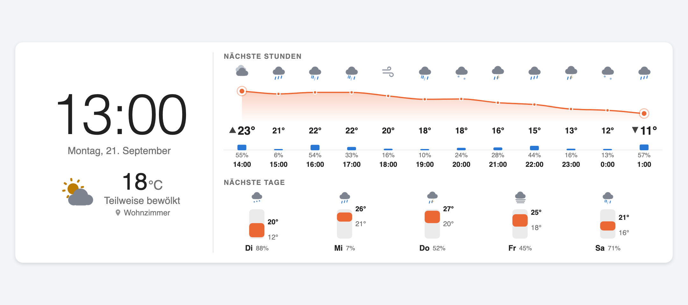
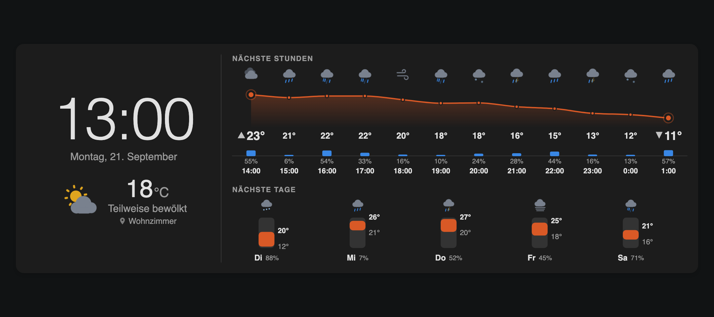
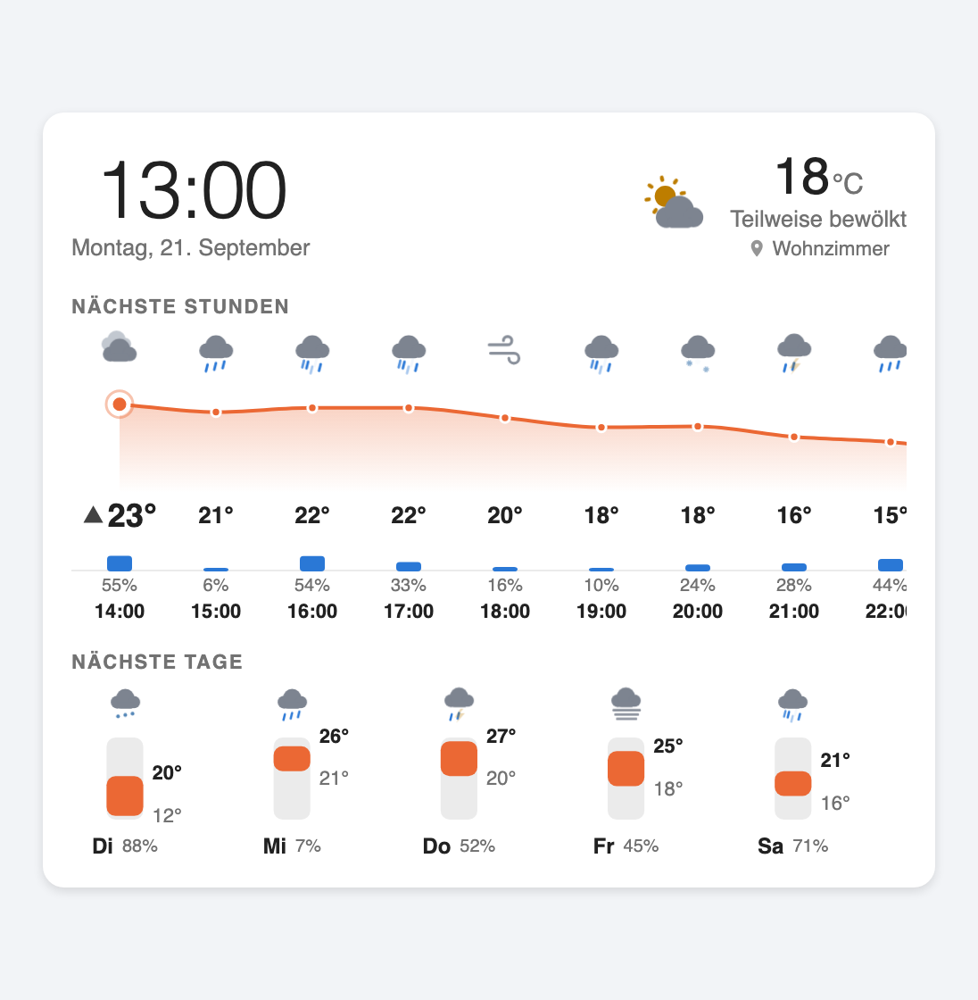
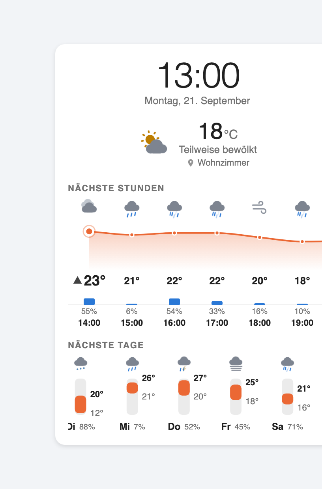
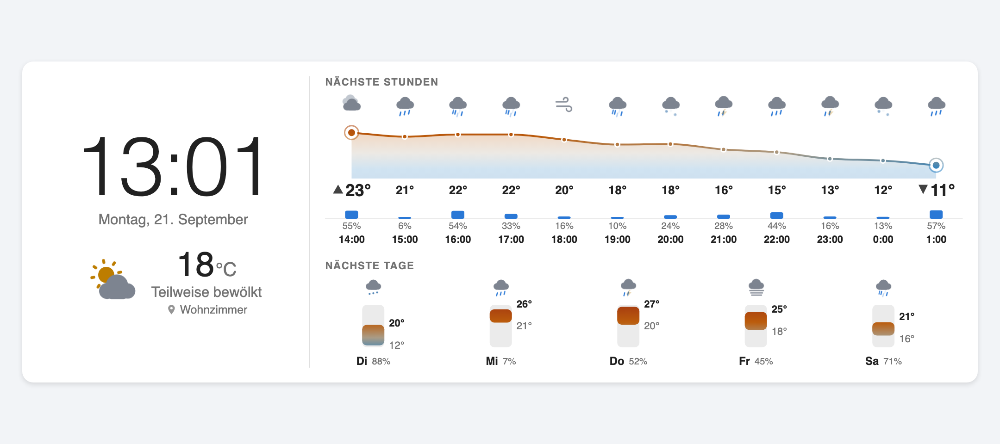
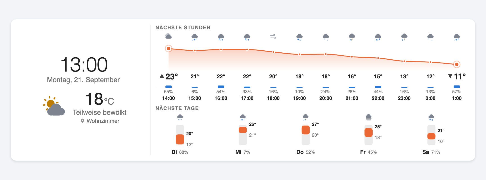
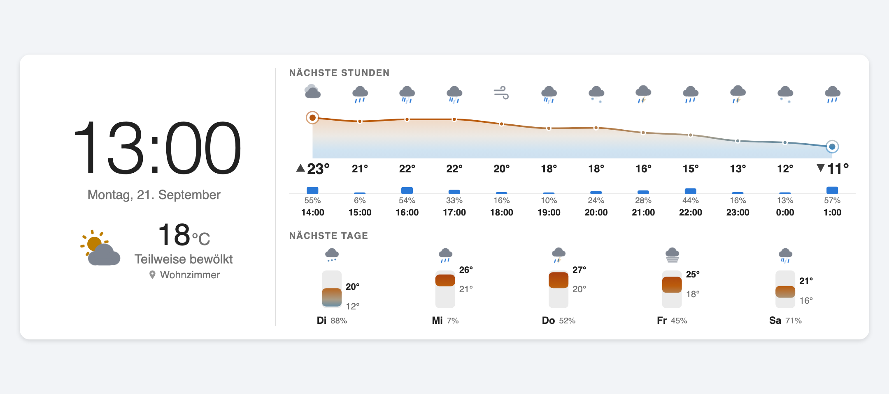
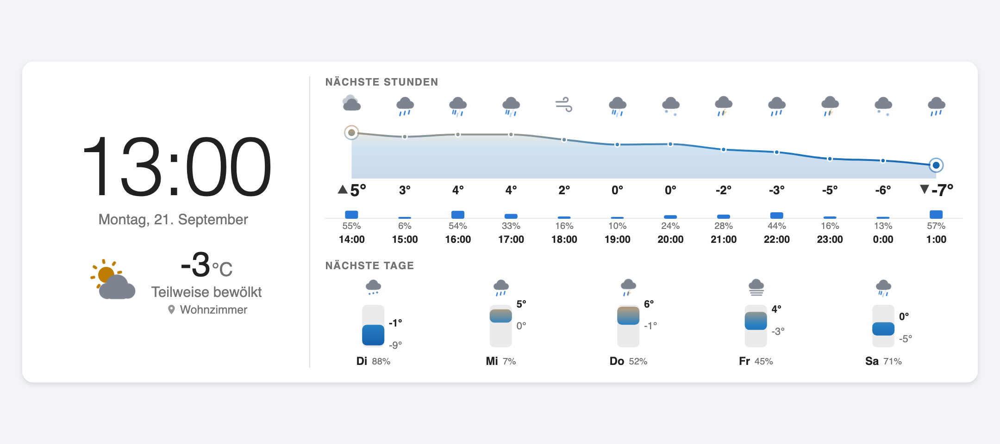

# Yet Another Clock Weather Card

A horizontal Lovelace card for Home Assistant: clock, date, current weather and
your next appointments on the left, hourly and daily forecast charts on the
right.

> Not related to [pkissling/clock-weather-card](https://github.com/pkissling/clock-weather-card)
> or any other card with a similar name. Yes, there are several. This is another
> one.





| One section (500px) | Phone (360px) |
|---|---|
|  |  |

The warmest and coldest hour are marked on the curve
(`show_hourly_extremes`, on by default):



`compact_mode: true`:



`temperature_color_mode: dynamic` -- the same card on a mild and on a frosty
week. The colour scale is absolute, so 20° looks the same in January and July:

| Mild | Frosty |
|---|---|
|  |  |

---

## Read this before installing

**The horizontal layout needs about 700px of card width.** A Home Assistant
section is capped at 500px (`--ha-view-sections-column-max-width`), so a card
dropped into a single section gets the *stacked* layout, not the one in the
screenshots. To get the wide layout, use one of:

- a **section with `column_span: 2`** (see `examples/sections-view.yaml`)
- a **panel view**, which gives the card the full viewport width
- a **masonry view** with a wide column

This is a dashboard setting, not a card option. The card cannot make itself
wider than the container it is given.

---

## Installation

### HACS

1. HACS → **Frontend** → ⋮ → **Custom repositories**
2. Add this repository, category **Dashboard** (previously *Lovelace/Plugin*)
3. Install **Yet Another Clock Weather Card**
4. HACS offers to add the Lovelace resource. If it does not, add it manually
   (below).

### Manual

1. Download `yet-another-clock-weather-card.js` from the
   [latest release](../../releases/latest) — or build it yourself:

   ```
   npm ci && npm run build
   ```

2. Copy it to `config/www/`:

   ```
   config/www/yet-another-clock-weather-card.js
   ```

3. Add the Lovelace resource: **Settings → Dashboards → ⋮ → Resources → Add**

   | Field | Value |
   |---|---|
   | URL | `/local/yet-another-clock-weather-card.js?v=0.1.0` |
   | Type | **JavaScript Module** |

   Or in YAML mode:

   ```yaml
   resources:
     - url: /local/yet-another-clock-weather-card.js?v=0.1.0
       type: module
   ```

   The `?v=` is not decoration: `/local/` is served with a one-month
   `Cache-Control`, so a new file behind an unchanged URL is simply not
   fetched. Bump it on every deploy. See *Troubleshooting*.

4. Reload the browser with a hard refresh (Ctrl/Cmd + Shift + R). Lovelace
   resources are cached aggressively.

### Requirements

| | |
|---|---|
| Home Assistant | **2024.4.0 or newer** |
| Weather entity | any, with `daily`, `hourly` or `twice_daily` forecast support |

2024.4 is where the legacy `forecast` state attribute was removed. The card uses
only the current API, so it does not work on older installations and does not
carry code that pretends to.

---

## Configuration

Minimal — everything else has a default:

```yaml
type: custom:yet-another-clock-weather-card
weather_entity: weather.home
```

A visual editor is available in the card picker. The YAML stays flat; the editor
only groups the options into sections so the form is usable.

More examples in [`examples/`](examples/).

### Options

#### Required

| Option | Type | Description |
|---|---|---|
| `weather_entity` | string | The weather entity, e.g. `weather.home`. Must start with `weather.`. |

#### Clock & date

| Option | Type | Default | Description |
|---|---|---|---|
| `time_format` | `auto` \| `24h` \| `12h` | `auto` | `auto` follows the user's Home Assistant setting. |
| `show_seconds` | boolean | `false` | Also raises the clock's tick rate from 60/h to 3600/h. |
| `show_date` | boolean | `true` | |
| `show_year` | boolean | `false` | |
| `date_locale` | string | `auto` | `auto` uses the Home Assistant language. Otherwise a BCP 47 tag such as `de-DE`. An unparseable value falls back to `auto`. |

#### Current weather

| Option | Type | Default | Description |
|---|---|---|---|
| `show_current_weather` | boolean | `true` | |
| `show_location` | boolean | `true` | A place name under the condition. |
| `location_name` | string | entity name | Overrides the label; otherwise the weather entity's friendly name. |
| `weather_tap_action` | action | `more-info` | See *Tap actions*. |
| `show_feels_like` | boolean | `false` | Only rendered if the integration reports `apparent_temperature`. |
| `show_humidity` | boolean | `false` | |
| `show_wind` | boolean | `false` | |

#### Forecast

| Option | Type | Default | Description |
|---|---|---|---|
| `show_hourly_forecast` | boolean | `true` | Hidden automatically if the entity has no hourly forecast. |
| `forecast_hours` | number | `12` | 1–48, clamped. |
| `hourly_scroll` | boolean | `true` | Horizontal scrolling when the hours do not fit. |
| `show_daily_forecast` | boolean | `true` | |
| `forecast_days` | number | `5` | 1–10, clamped. |
| `show_precipitation_probability` | boolean | `true` | Bar track plus percentage. |
| `show_precipitation_amount` | boolean | `false` | How much rain, in the entity's `precipitation_unit`. |
| `night_icons_hourly` | boolean | `true` | See *Night icons* below. |
| `show_hourly_extremes` | boolean | `true` | Marks the warmest and coldest hour on show. |
| `forecast_ratio` | number | `1.5` | Height of the hourly block relative to the daily one; `1.5` is 3:2. Range 0.5–4. |

#### Calendar

| Option | Type | Default | Description |
|---|---|---|---|
| `show_calendar` | boolean | `false` | Upcoming appointments in the left column. |
| `calendar_entities` | string or list | – | One or more `calendar.*` entities. |
| `calendar_count` | number | `3` | Events shown, 1–10. |
| `calendar_days_ahead` | number | `14` | How far ahead to look, 1–60 days. |
| `calendar_tap_action` | action | navigate to `/calendar` | See *Tap actions*. |

#### Temperature colour

| Option | Type | Default | Description |
|---|---|---|---|
| `temperature_color_mode` | `static` \| `dynamic` | `static` | `dynamic` colours every mark by its temperature. |
| `temperature_color_min` | number | `-5` °C / `23` °F | Everything at or below this is the deepest blue. |
| `temperature_color_max` | number | `35` °C / `95` °F | Everything at or above this is the deepest red. |

In `dynamic` mode `temperature_color` is ignored. The bounds are read in the
unit the entity reports, and the defaults switch with it.

#### Appearance

| Option | Type | Default | Description |
|---|---|---|---|
| `compact_mode` | boolean | `false` | Smaller icons, shorter charts, tighter spacing. |
| `glass_effect` | boolean | `false` | `backdrop-filter`. Only visible on views with a background image — see *Known limitations*. |
| `animation` | boolean | `true` | Weather icon animation. Always off under `prefers-reduced-motion`. |
| `accent_color` | string | theme | Focus rings and highlights. |
| `temperature_color` | string | built-in | The temperature series. |
| `precipitation_color` | string | built-in | The precipitation series. |
| `card_background` | string | theme | |
| `border_radius` | string | theme | Any CSS length, e.g. `18px`. |
| `card_padding` | string | `16px` | |
| `icon_size` | string | `40px` | Forecast icon size. |
| `clock_size` | string | scales with the card | Any CSS length, e.g. `5.5rem`. |
| `clock_weight` | string | `300` | Any CSS font weight, e.g. `700` for bold. |
| `temperature_size` | string | scales with the card | Size of the current temperature. |
| `current_icon_size` | string | scales with the card | Size of the current-weather icon. |

The three hero sizes default to a `clamp()` that scales with the card's width,
so they grow on a wide dashboard on their own. Set them only to override that.

Every appearance option writes into a CSS custom property, so a theme or
`card_mod` can steer exactly the same values:

```
--yacw-temp  --yacw-precip  --yacw-accent  --yacw-surface  --yacw-radius
--yacw-padding  --yacw-icon-size  --yacw-clock-size  --yacw-clock-weight
--yacw-temperature-size
--yacw-current-icon-size  --yacw-icon-sun  --yacw-icon-moon
--yacw-icon-cloud  --yacw-icon-cloud-back  --yacw-icon-rain  --yacw-icon-snow
--yacw-icon-bolt  --yacw-icon-fog
```

### Deliberately absent

| Not an option | Why |
|---|---|
| `temperature_unit` | The entity reports `temperature_unit` and Home Assistant has already converted the value to the user's unit system. A second conversion in the card would either double-convert or mislabel. |
| `theme` | Home Assistant has no per-card light/dark; the theme decides. Forcing one would mean hard-coded colours that break under every custom theme. The card follows `hass.themes.darkMode`. |

---

## How it gets its data

The card uses the **`weather/subscribe_forecast` websocket subscription**, which
is the only forecast API in current Home Assistant.

- The legacy `forecast` state attribute was deprecated when the subscription
  shipped in **2023.8** and removed in **2024.4**. Most examples on the internet
  still read it; on a current installation it is `undefined`.
- `weather.get_forecasts` (the action with a `response_variable`) would also
  work, but it returns a snapshot and would force the card to run its own poll
  timer. The subscription is pushed by Home Assistant, so there is no polling
  interval in this card at all.
- The websocket client re-establishes subscriptions after a dropped connection
  on its own (`resubscribe` defaults to true). The card handles the separate
  case of Lovelace detaching it from the DOM, which happens on every tab switch.

One subscription per forecast type, torn down when the card is removed —
including the awkward case where the card is destroyed while the subscribe
promise is still in flight.

### Tap actions

Both the current weather and the calendar rows are clickable, using Home
Assistant's standard action schema -- a `tap_action` written for any other card
can be pasted here unchanged.

The card has two independent regions, so there is deliberately no bare
`tap_action`: name the region with `weather_tap_action` or
`calendar_tap_action`.

| `action` | Notes |
|---|---|
| `more-info` | Default for the weather. Without an explicit `entity`, the weather block uses the weather entity and a calendar row uses **the calendar that appointment came from**. |
| `navigate` | `navigation_path`, optional `navigation_replace`. Default for the calendar (`/calendar`). |
| `url` | `url_path`. Only `http`, `https`, `mailto`, `tel` and relative paths are opened. |
| `toggle` | Toggles `entity`, or the region's own entity. |
| `perform-action` | `perform_action`, `data`, `target`. `call-service`/`service`/`service_data` still work. |
| `fire-dom-event` | Fires `ll-custom`, for browser_mod and friends. |
| `none` | No action -- and the region loses its hover, its focus ring and its button role, rather than looking clickable and doing nothing. |

**Not supported:** `assist` and `confirmation`. Both need dialogs that are
lazily imported from inside the frontend bundle, which a custom card cannot
reach. They are rejected at configuration time rather than ignored at click
time. `hold_action` and `double_tap_action` are not implemented either.

### Calendar

Calendars are the one thing on this card that cannot be pushed: Home Assistant
has no `calendar/subscribe`, only `GET /api/calendars/<entity_id>?start=&end=`.
So this part does poll -- as rarely as it can while staying correct:

- when a calendar entity changes state, which Home Assistant does as events
  begin and end (this is what catches a newly added appointment)
- at local midnight, so "Today" and "Tomorrow" re-label themselves
- when the browser tab becomes visible again
- and a 15-minute backstop for anything the above misses

Every timer stops while the card is detached or the tab is hidden. A calendar
that fails to load does not blank the others.

### How the two forecast blocks share the height

`forecast_ratio` is the height of the hourly block relative to the daily one,
`1.5` (3:2) by default. The hourly curve grows into whatever it is given: its
plot is measured, not a constant, so a taller block means a taller curve rather
than more whitespace.

It can only divide height that exists. Neither block is ever squeezed below what
its own rows need, so on a card whose height is set by the forecast content
itself both sit at their minimum and the ratio has nothing to distribute -- that
already works out at about 3:2. The ratio bites when the hero column is the
taller side, which is the usual case once the clock is enlarged or the calendar
is switched on.

### Night icons

Home Assistant's own weather card decides "night" from `is_daytime`, and treats
a missing value as day. `is_daytime` only exists on `twice_daily` forecasts, so
every hourly entry is missing it — which is why a `sunny` hour at 23:00 shows a
sun in the built-in card.

With `night_icons_hourly: true` (the default) this card instead derives sunrise
and sunset from `sun.sun` and applies them to each forecast timestamp. This is a
deliberate deviation from the built-in behaviour. Set it to `false` to match
Home Assistant. Without a `sun.sun` entity the card falls back to daytime icons.

### Charts

- **Hours** are an area curve. Temperature is continuous between two hours, so
  interpolating is honest. The interpolation is monotone (Fritsch–Carlson), which
  cannot invent a peak warmer than any forecast value the way an ordinary
  smoothing spline can.
- **Days** are range bars from low to high, not a curve. A day is a discrete
  bucket; a line between Monday's high and Tuesday's high would assert
  temperatures for points that do not exist.
- **Probability and amount are separate channels.** `precipitation_probability`
  is how likely rain is (%), `precipitation` is how much falls (mm). 80 % of
  0.2 mm is drizzle; 30 % of 18 mm is a downpour you would want to know about.
  Either can be shown without the other, and the amount is per forecast period
  -- per hour in the hourly block, per day in the daily one.
- **The warmest and coldest hour are marked** with a haloed node on the curve,
  an enlarged bold value and a small ▲ / ▼. Several channels, because size
  alone is weak for low vision and the glyph survives greyscale. On a tie the
  first hour wins, so a plateau gets one marker rather than six; when every
  hour is the same temperature nothing is marked at all.
- **The hour axis thins out as columns get narrow.** Past roughly 42px per
  column -- 24 hours without scrolling, for instance -- the glyph is dropped and
  the labels lose their minutes, which are always `00` anyway. The screen
  reader text is not tied to the glyph and stays either way.
- **Precipitation gets its own baseline** in the hourly block, never a second
  y-axis on the temperature plot. Percent and degrees do not share a scale, and
  two scales in one frame can be slid against each other until any correlation
  appears. In the daily block it rides along with the weekday instead: a bar
  track plus a label row cost 27px there and, on integrations that report no
  daily probability, carried almost nothing.
- **The daily readings sit beside their bar**, level with its ends, not in
  label bands above and below. Measured on the earlier layout those bands cost
  28 of the chart's 78 pixels while the bars inked only 44% of what was left --
  which is where the empty look came from. Beside the bar the numbers cost no
  vertical space and work at any bar length; when a bar is too short to hold
  both, only the labels move apart, never the bar.
- The series palette is validated for contrast and colour-vision separation
  against both the light and dark card surface. Overriding
  `temperature_color` / `precipitation_color` bypasses that check.

### The dynamic temperature scale

Two things about it are deliberate, because both have a wrong answer that looks
better at first glance.

**It is not a rainbow.** Blue-green-yellow-red is the reflex for temperature and
it is the classic mis-encoding: that hue order carries no perceptual ordering, so
nobody can say which of two colours is warmer without consulting a legend. This
is a two-hue diverging ramp -- cool blue, neutral midpoint, warm red -- where hue
carries the direction and lightness carries the distance from the middle.
Lightness rises monotonically from both ends towards the midpoint and the two
ends match to within 0.002 in OKLab, which is what lets a cool and a warm mark be
compared directly.

**The domain is absolute, not the visible data.** A scale normalised to "the
coldest and warmest value on screen" would paint 15° deep blue in July and deep
red in January. A colour has to mean a temperature, not a rank inside today's
forecast, so the domain is configured once and does not move.

The midpoint -- exactly between `temperature_color_min` and
`temperature_color_max`, so 15 °C by default -- is the palest step and sits at
2.62:1 on a light card. A diverging ramp needs its lightest step in the middle
and on a light surface that step cannot also clear 3:1. That is acceptable here
only because every mark prints its value next to it and each chart ships a data
table, so colour never carries a number on its own. Narrow the domain to your
climate and the pale band shrinks.

---

## Accessibility

- Every chart is `aria-hidden` and paired with a visually hidden table carrying
  the same values, so the forecast is reachable without reading the graphic.
- The current-weather block is focusable and opens the more-info dialog with
  Enter or Space.
- Icon animation is fully disabled — not slowed — under
  `prefers-reduced-motion: reduce`.
- No information is carried by colour alone: every mark has a number beside it.

---

## Known limitations

- **The wide layout needs ~700px.** See the note at the top. This is the single
  most common surprise.
- **`glass_effect` needs something to blur.** `backdrop-filter` works on what is
  behind the card. On a plain-coloured view there is nothing behind it, and the
  effect degrades to a slightly translucent panel. It pays off on views with a
  background image.
- **The calendar polls.** There is no push API for calendars in Home Assistant
  (see above), so it cannot be as immediate as the weather.
- **Not every integration supplies every field.** `apparent_temperature`,
  `precipitation_probability` and `precipitation` are optional in the Home
  Assistant API. Missing values hide their element rather than printing
  `undefined`.
- **`twice_daily`-only entities** get their two entries per day folded into one:
  the daytime entry supplies the high and the condition, the night entry the low.
  This is an approximation, but it beats showing nothing.
- **Animated icons are the card's own SVGs.** Home Assistant's animated weather
  SVGs live inside the frontend bundle and are not reachable from a custom card.
  Themes that override `--weather-icon-<condition>` are honoured.
- **The visual editor is only covered by a stand-in for `ha-form`.**
  `demo/editor-test.html` reproduces the binding rule that actually matters
  (`getValue` and `flatten` on expandable sections) and exercises the full round
  trip, but Home Assistant's real `ha-form` has not run against this schema.

---

## Troubleshooting

**The card shows "Entity not found".**
The entity id in `weather_entity` does not exist. Check it in Developer Tools →
States. The name must start with `weather.`.

**The card is stacked instead of horizontal.**
It is narrower than 700px. Give the section `column_span: 2`, or use a panel
view. See the note at the top.

**The daily forecast shows fewer days than I configured.**
`forecast_days` is an upper bound, not a promise -- the card can only draw the
days the integration sends. Check how many you actually get:

```yaml
action: weather.get_forecasts
target:
  entity_id: weather.home
data:
  type: daily
```

The value is also clamped to 10. Days already past are dropped by calendar day,
so today still counts until midnight even though its entry is usually
timestamped 00:00.

**The forecast section says "No forecast available".**
Either the integration returned no data, or it does not support that forecast
type. Verify with Developer Tools → Actions:

```yaml
action: weather.get_forecasts
target:
  entity_id: weather.home
data:
  type: hourly
```

If that returns an empty list, the card has nothing to draw. Some integrations
provide daily but not hourly.

**Nothing appears / "Custom element doesn't exist".**
The resource is not loaded. Check the URL under Settings → Dashboards →
Resources, then hard-refresh.

**The card does not update after I copy a new file.**
This one is structural, not bad luck. Home Assistant registers `/local` with
cache headers on (`frontend/__init__.py`) and serves it with

```
Cache-Control: public, max-age=2678400
```

— one month (`http/static.py`). The browser does not even ask whether the file
changed. A hard refresh bypasses that for a single request, which is why it
sometimes appears to work: another tab, phone or tablet is still on the old
file.

The fix is to change the URL, not the file:

```yaml
resources:
  - url: /local/yet-another-clock-weather-card.js?v=0.2.0
    type: module
```

Bump `?v=` on every deploy. HACS does exactly this by itself — it registers
`/hacsfiles/<repo>/<file>.js?hacstag=<id><version>` and moves the tag on each
update — which is why the problem never shows up on a HACS install and reliably
does on a hand-registered one.

The card logs its version to the browser console on load; that is how to check
which file is actually live.

**Two resource entries are worse than a stale cache.** Editing `?v=` is the
point -- adding a *second* entry loads this bundle twice, and the second
`customElements.define` cannot run. Whichever copy loaded first wins, so an
update silently does nothing. The card survives this instead of throwing
halfway through, and says so in the console:

```
[yet-another-clock-weather-card] is already registered, so this copy does
nothing. You very likely have two Lovelace resource entries...
```

Integrations that ship a card can avoid the situation entirely by reconciling
the resource list from Python, matching on the path so a version bump edits the
existing entry. A card-only repository has no Python side, so HACS -- which does
the same reconciliation -- is the supported route.

**Times are wrong by a few hours.**
The card follows the Home Assistant time-zone setting
(Settings → System → General, plus the per-user "Time zone" preference). If that
is set to the server's time zone, the card uses it rather than the browser's.

---

## Development

```
npm ci
npm run build      # typecheck + single-file bundle into dist/
npm run check      # format, lint, types, build
npm run watch      # rebuild on change
```

A demo harness with mock Home Assistant data, including the failure states, is
at `demo/index.html`:

```
npm run build && python3 -m http.server 4173
```

then open <http://localhost:4173/demo/>.

`demo/action-test.html` clicks each region and checks that the configured action
actually happens -- including that `none` removes the affordance and that a
`javascript:` URL is refused.

`demo/forecast-days-test.html` renders the daily forecast across the timestamp
conventions integrations use (midnight, noon, current time) and checks that the
rendered column count matches `min(requested, supplied)`.

`demo/editor-test.html` checks the visual editor against a stand-in for
`ha-form` that copies its `getValue`/`flatten` binding rule: whether the grouped
controls read their values, write back to flat keys, and leave the config free
of nested sections.

`demo/leak-test.html` on the same server exercises the subscription lifecycle --
attach/detach, Lovelace tab switches, and teardown while the subscribe promise is
still pending -- and reports whether any subscription was left open.

Screenshots are regenerated with `./scripts/screenshots.sh`; the recipe and the
sizes are documented in [`docs/screenshots.md`](docs/screenshots.md).

### Project layout

```
src/
  main.ts                     entry point, card registration
  card.ts                     layout, error states, hass wiring
  editor.ts                   ha-form schema for the visual editor
  components/
    clock.ts                  owns its own timer
    current-weather.ts
    hourly-forecast.ts        area curve + precipitation track
    daily-forecast.ts         range bars + precipitation track
    weather-icon.ts           composed animated SVG
    forecast-base.ts          width measurement for the charts
  data/
    forecast-controller.ts    websocket subscription lifecycle
    weather.ts                normalization, feature flags, day/night
    defaults.ts               defaults and config validation
  icons/primitives.ts         SVG building blocks
  utils/                      chart maths, date formatting, units, strings
  styles/tokens.ts            CSS custom properties
```

The split is by **update frequency**, not by visual grouping: the clock owns its
own timer and its own state so a tick re-renders one element instead of the
forecast charts.

## Licence

MIT
